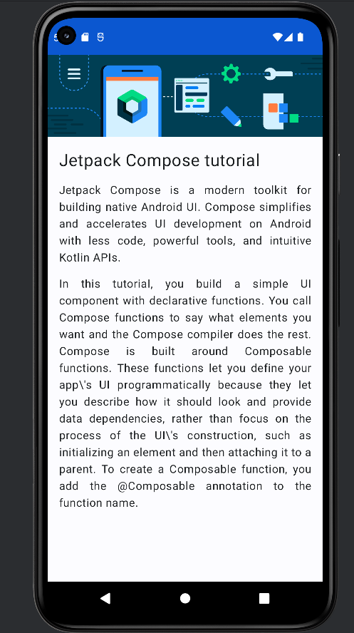
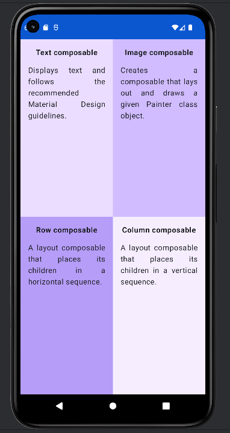
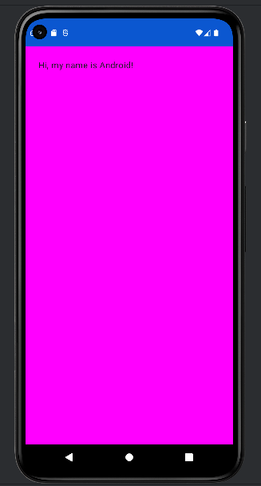
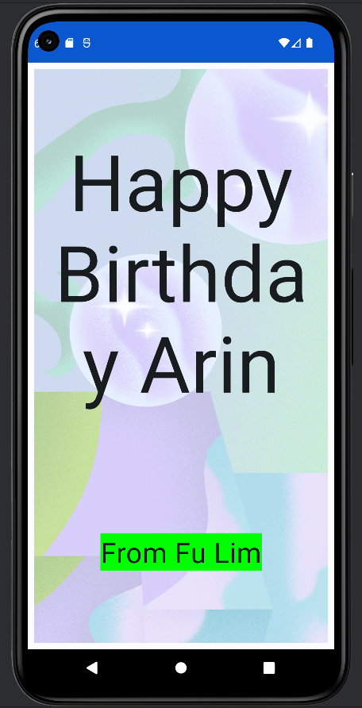

# Table of Contents
[01 Build For Basic Layout](#01-build-for-basic-layout)

[02 Kotlin Fundamentals](#02-kotlin-fundamentals)

# 01 Build For Basic Layout

## Business Card


## Compose article


## Compose Quadrant


## Greeting Card


## Happy Birthday Card


## Task Manager


# 02 Kotlin Fundamentals
Reference: https://developer.android.com/codelabs/basic-android-kotlin-compose-classes-and-objects

Output:
```
Android TV is turned on. Speaker volume is set to 2 and channel number is set to 1.
Google Light turned on. The brightness level is 2.
Android TV is turned on. Speaker volume is set to 2 and channel number is set to 1.
Google Light turned on. The brightness level is 2.
Device name: Android TV, category: Entertainment, type: Smart TV
Device name: Google Light, category: Utility, type: Smart Light
Speaker volume increased to 3.
Speaker volume decreased to 2.
Channel number increased to 2.
Channel number decreased to 1.
Brightness increased to 3.
Brightness increased to 2.
```